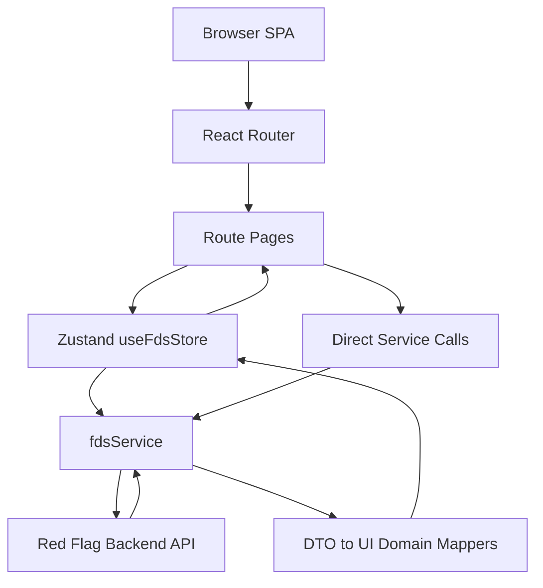

# FDS Console Frontend Architecture

## 1. Purpose

`fds-console` is the React frontend for the Red Flag FDS administrator console. It provides operational screens for fraud monitoring, suspicious transaction review, administrator actions, policy management, audit log review, and report download.

The frontend is a browser-only single page application. It does not own fraud detection logic or persistence; it authenticates with the backend API, maps backend DTOs into UI domain types, and renders a dashboard-oriented operating console.

## 2. Technology Stack

| Area | Choice | Role |
| --- | --- | --- |
| Runtime UI | React 19 | Component rendering and page composition |
| Language | TypeScript | Domain types, API DTO typing, safer UI state |
| Build tool | Vite 8 | Dev server, production bundle, env injection |
| Routing | React Router 7 | Browser routes and protected route layout |
| State | Zustand 5 | Global FDS dashboard, transaction, rule, audit, auth state |
| Charts | Recharts | Dashboard distribution charts |
| Icons | Lucide React | Button and navigation iconography |
| Styling | Tailwind CSS 4 plugin + `src/index.css` | Utility classes plus FDS design tokens/components |

## 3. Application Entry

```text
index.html
  -> src/main.tsx
    -> src/app/App.tsx
      -> RouterProvider(router)
```

`src/main.tsx` mounts the app into `#root`, wraps it in `React.StrictMode`, and imports `src/index.css` as the global stylesheet.

`src/app/App.tsx` is intentionally small. It only installs the React Router provider.

The root `src/App.tsx` re-exports `src/app/App.tsx`; it exists as a compatibility wrapper and is not the primary app implementation.

## 4. Runtime Configuration

The frontend reads Vite environment variables through `import.meta.env`.

| Variable | Default | Used By | Purpose |
| --- | --- | --- | --- |
| `VITE_API_BASE_URL` | `http://localhost:4000/api` | `src/services/fdsService.ts` | Backend API base URL |
| `VITE_ADMIN_EMAIL` | `admin@fds.local` | `LoginPage`, `fdsService` | Default admin login identity |
| `VITE_ADMIN_PASSWORD` | `Admin1234!` | `LoginPage`, `fdsService` | Default admin login password |
| `VITE_DATA_SOURCE` | `api-demo` | `fdsService.withDataSource` | Adds `source=<value>` to dashboard/list API calls |

`.env.example` currently sets `VITE_DATA_SOURCE=ai-import`, while the code fallback is `api-demo`. If the environment file is missing or not loaded, the frontend will query a different source dataset than the checked-in example suggests.

Development mode also enables auto-login in `LoginPage` via `import.meta.env.DEV` when no token exists in `localStorage`.

## 5. Routing Architecture

Routes are defined in `src/app/router.tsx`.

| Path | Component | Protection | Purpose |
| --- | --- | --- | --- |
| `/login` | `LoginPage` | Public | Admin sign-in |
| `/` | `DashboardPage` | `ProtectedRoute` + `Layout` | FDS summary dashboard |
| `/alerts` | `AlertQueuePage` | `ProtectedRoute` + `Layout` | Suspicious transaction queue |
| `/alerts/:id` | `TransactionDetailPage` | `ProtectedRoute` + `Layout` | Transaction detail, reasons, actions, ARS |
| `/policy` | `PolicyManagementPage` | `ProtectedRoute` + `Layout` | Policy rule management |
| `/audit` | `AuditLogPage` | `ProtectedRoute` + `Layout` | Action and policy audit log |
| `/reports` | `ReportsPage` | `ProtectedRoute` + `Layout` | CSV/PDF report download |

`ProtectedRoute` is a client-side guard that checks `localStorage.getItem('fds_token')`. If no token exists, it redirects to `/login`. This is a UI guard only; backend authorization remains authoritative.

`Layout` composes shared shell UI:

```text
Layout
  -> Sidebar
  -> Header
  -> main Outlet
```

## 6. Component Structure

```text
src/
  app/          Router, protected route, shell layout
  components/
    common/     Badge, BrandLogo
    layout/     Header, Sidebar
  pages/        Route-level screens
  services/     Backend API calls, auth, DTO mapping
  store/        Zustand global state/actions
  types/        UI domain types
  utils/        Time formatting and memo validation
  data/         Local mock rule/transaction data retained for reference/fallback
```

The main page components are route-owned and pull state/actions from `useFdsStore` or call specialized service functions directly when the workflow is narrow.

`src/data` contains mock files, but the current production flow does not use them for policy or transaction screens. Policy rules and transactions are fetched from the backend API.

Shared visual primitives are intentionally light:

- `Badge.tsx` maps risk/status enums into UI labels and badge classes.
- `BrandLogo.tsx` renders the product identity.
- `Header.tsx` handles top navigation, global search navigation, notification counts, KST clock, and logout.
- `Sidebar.tsx` provides secondary navigation.

## 7. State Management

Global state is centralized in `src/store/useFdsStore.ts`.

### State Shape

| State | Type | Purpose |
| --- | --- | --- |
| `transactions` | `TransactionAlert[]` | Current transaction queue/list |
| `selectedTransaction` | `TransactionAlert | undefined` | Detail page record |
| `rules` | `PolicyRule[]` | Policy management screen data |
| `auditLogs` | `AuditLog[]` | Dashboard/audit log source |
| `stats` | `DashboardStats` | Dashboard metric cards and charts |
| `isLoading` | `boolean` | Shared loading flag |
| `error` | `string | undefined` | Shared fetch/action error |
| `arsPollingId` | `number | null` | Active ARS polling interval ID |
| `currentUser` | user object or `null` | Header user display and auth state |
| `isAuthenticated` | `boolean` | Derived from token presence at store creation |

### Store Actions

| Action | Data Flow |
| --- | --- |
| `fetchDashboard` | Fetches stats and transactions in parallel, then fetches detail-derived audit logs for the first 20 transactions |
| `fetchTransactions` | Refreshes transaction list |
| `fetchTransactionDetail` | Loads one transaction, updates list cache, rebuilds detail audit entries |
| `fetchRules` | Loads policy rules |
| `applyAdminAction` | Posts action/memo, reloads detail, refreshes stats |
| `toggleRule` | Toggles policy rule and appends a local audit-log entry |
| `startArsPolling` | Polls a transaction every 3 seconds while status is `CALL_REQUIRED` or `CALL_IN_PROGRESS` |
| `stopArsPolling` | Clears the active ARS polling interval |
| `setCurrentUser` / `clearAuth` | Updates client auth display state |

`fetchDashboard({ silent: true })` is used for background refreshes without resetting page loading state.

## 8. API Service Layer

All backend integration is concentrated in `src/services/fdsService.ts`.

### Responsibilities

- Hold `API_BASE_URL`, default admin credentials, and `DATA_SOURCE`.
- Manage `tokenCache` initialized from `localStorage.fds_token`.
- Send `Authorization: Bearer <token>` for authenticated requests.
- Retry once after `401` by calling `login()` with configured admin credentials.
- Convert backend snake_case DTOs into frontend camelCase domain types.
- Normalize display labels for statuses, channels, timestamps, and risk reasons.
- Download report blobs and trigger browser downloads.

### Main API Calls

| Service Method | Backend Endpoint |
| --- | --- |
| `login` | `POST /auth/login` |
| `getDashboardStats` | `GET /admin/stats?source=<VITE_DATA_SOURCE>` |
| `getTransactions` | `GET /admin/suspicious-transactions?risk=all&source=<VITE_DATA_SOURCE>` |
| `getTransactionById` | `GET /admin/transactions/:id` |
| `applyAdminAction` | `POST /admin/transactions/:id/actions` |
| `getPolicyRules` | `GET /admin/policy-rules` |
| `togglePolicyRule` | `POST /admin/policy-rules/:id/toggle` |
| `createSimulatedTransaction` | `POST /admin/transactions` |
| `requestArsCall` | `POST /transactions/:id/ars-call` |
| `downloadReport` | `GET /reports/fraud.csv` or `GET /reports/fraud.pdf` |

### Mapping Boundary

Backend DTO interfaces are declared inside `fdsService.ts` and are not exported. UI components consume only the domain types from `src/types/fds.ts`, such as `TransactionAlert`, `DashboardStats`, `PolicyRule`, and `AuditLog`.

Important mapping behavior:

- `type: PAYMENT` maps to UI channel `CARD`.
- `type: TRANSFER` maps to `TRANSFER`.
- `type: WITHDRAWAL` maps to `WITHDRAWAL`.
- Other transaction types map to `E-PAY`.
- Dates are formatted with `toLocaleString('ko-KR', { hour12: false })`.
- `recommendedAction` is currently derived from transaction status on the frontend.
- Broken Korean reason labels from existing data are normalized in `normalizeBrokenReasonLabel`.

## 9. Authentication Flow

```text
LoginPage form
  -> login(emailOrUsername, password)
    -> POST /auth/login
      -> token + user
        -> reject non-ADMIN user
        -> localStorage.fds_token
        -> useFdsStore.setCurrentUser(user)
        -> navigate("/")
```

`LoginPage` blocks non-admin users after `login()` returns by checking `data.user.role !== 'ADMIN'`. Because `login()` itself has already updated `tokenCache` and `localStorage`, a non-admin login attempt can briefly leave a non-admin token cached before the page removes `localStorage.fds_token`. This should be tightened if non-admin accounts are expected to use the same backend.

For API calls after login:

```text
fdsService.request()
  -> attach tokenCache as Bearer token
  -> if 401 and retry allowed:
      login(default admin credentials)
      retry original request once
```

Logout is handled in `Header`:

```text
logout()
  -> remove localStorage.fds_token
  -> tokenCache = null
  -> useFdsStore.clearAuth()
  -> navigate("/login")
```

## 10. Dashboard Refresh Flow

`DashboardPage` calls `fetchDashboard()` on mount and starts a 3-second polling interval.

```text
DashboardPage useEffect
  -> fetchDashboard()
  -> every 3 seconds:
      fetchDashboard({ silent: true })
```

The dashboard renders:

- metric cards from `DashboardStats`
- a live transaction side panel from `transactions`
- recent transaction table from the first 8 transactions
- risk distribution chart from `normalCount`, `suspiciousCount`, `dangerCount`
- simulated high-risk transaction creation through `createSimulatedTransaction`

## 11. Transaction Detail and ARS Flow

`TransactionDetailPage` loads the selected transaction by route param.

```text
/alerts/:id
  -> fetchTransactionDetail(id)
  -> selectedTransaction
  -> render transaction info, customer info, risk reasons, action logs, ARS call history
```

If the selected transaction status is `CALL_REQUIRED` or `CALL_IN_PROGRESS`, the store starts polling every 3 seconds via `fetchTransactionSilent(id)`. Polling stops when the status leaves those two states.

Manual ARS action uses `requestArsCall(id)`, then reloads detail.

Admin actions require a selected action and memo. `memoValidation.ts` prevents logically contradictory approval memos, such as approving while describing block/hold intent.

## 12. Policy, Audit, and Reports

`PolicyManagementPage` loads policy rules through `fetchRules`, filters locally by category/search query, and toggles rules through `toggleRule(id, reason)`.

`AuditLogPage` consumes `auditLogs` from the store. The store builds transaction action audit entries from transaction detail records and appends local policy-change entries after rule toggles.

`ReportsPage` uses current stats for summary cards and calls `downloadReport('csv' | 'pdf')`.

## 13. Styling Architecture

The app uses a hybrid styling model:

- FDS design tokens and component classes are defined in `src/index.css`.
- Page components use those semantic classes, for example `fds-card`, `fds-btn`, `fds-table`, `fds-badge`, `fds-page-title`.
- Tailwind utility classes are used for local layout and spacing.
- Icons are imported from `lucide-react`.

This keeps repeated console UI patterns centralized while allowing compact page-level composition.

## 14. Data Flow Summary



Direct service calls are used for narrow actions such as login, report download, simulated transaction creation, and manual ARS request. Shared dashboard/list/detail/rule state flows through the store.

## 15. Current Constraints and Risks

- Authentication guard is client-side token presence only. Backend authorization must remain the source of truth.
- `currentUser` is stored only in Zustand memory. A page refresh with an existing token keeps route access, but the header falls back to the default admin display until login state is set again.
- Automatic retry after `401` uses configured default admin credentials. This is convenient for local/demo use but should be reviewed before production use.
- `VITE_DATA_SOURCE` affects stats and suspicious transaction list APIs, but not transaction detail APIs.
- `p95Latency` is currently hard-coded to `128` in the frontend stats mapper.
- Audit logs are partly derived by fetching details for the first 20 transactions, so audit coverage depends on currently loaded transaction data.
- Some old AI-generated reason labels can arrive already garbled from stored backend data; the frontend contains a display normalization fallback for those labels.
- There is no dedicated frontend test suite in this project; the primary verification path is `npm run build`.
- Vite has no dev proxy configured. Local development depends on backend CORS allowing the frontend origin.
- `src/data` mock files can be mistaken for active data sources, but current route pages use backend-backed store/service calls.
- Multiple 3-second refresh loops can be active depending on the screen: dashboard polling, header dashboard bootstrap, alert/detail refresh behavior, and ARS detail polling should be considered when evaluating backend load.
- README does not fully document `VITE_DATA_SOURCE`, simulated transaction creation, or manual ARS request endpoints; this architecture document reflects the code rather than README alone.
- TypeScript is configured for bundler resolution with `noEmit`, `allowImportingTsExtensions`, `noUnusedLocals`, and `noUnusedParameters`, so type/build failures are surfaced by `npm run build`.

## 16. Verification

The architecture described above was checked against:

- `README.md`
- `package.json`
- `vite.config.ts`
- `src/main.tsx`
- `src/app/App.tsx`
- `src/app/AppShell.tsx`
- `src/app/router.tsx`
- `src/services/fdsService.ts`
- `src/store/useFdsStore.ts`
- `src/types/fds.ts`
- route page and layout component imports

Build verification command:

```bash
npm run build
```
